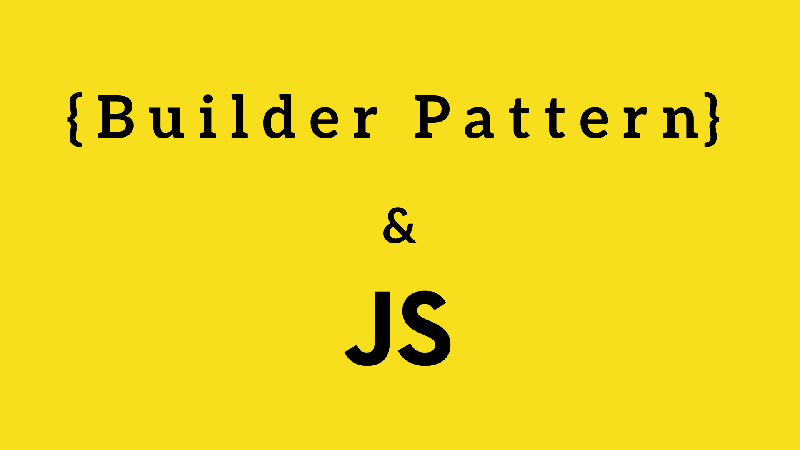

# Builder Pattern en JavaScript

## Définition
*"Le builder pattern est un modèle de conception conçu pour fournir une solution flexible à divers problèmes de création d'objets dans la programmation orientée objet. L'intention du design pattern Builder est de séparer la construction d'un objet complexe de sa représentation."* -- Wikipédia

## Concrètement
Dans un premier temps, créons une classe **Cat**.

```javascript
class Cat {
    constructor(name, gender, size, weight, breed) {
        this.name = name;
        this.gender = gender;
        this.size = size;
        this.weight = weight;
        this.breed = breed;
    }
}
```

L'objet est simple, le constructeur est concis et le code est très lisible. Cependant, si nous souhaitons ajouter de la logique au moment de la construction de l'object, il sera nécessaire d'ajouter ces lignes de codes dans le constructeur. Il n'y aura alors qu'un unique bloc servant à la création de l'objet comportant des règles métiers, portant sur différentes propriétés.

Créons un nouvel objet de type **Builder** associé à la class Cat.

```javascript
class CatBuilder {
    
    constructor() {}

    setName(name) {
        this.name = name;
        return this;
    }

    setGender(gender) {
        this.gender = gender;
        return this;
    }

    setSize(size) {
        this.size = size;
        return this;
    }

    setWeight(weight) {
        this.weight = weight;
        return this;
    }

    setBreed(breed) {
        this.breed = breed;
        return this;
    }

    build() {
        return new Cat(this.name, this.gender, this.size, this.weight, this.breed);
    }
}

const catFromBuilder = new CatBuilder()
    .setName('Brume')
    .setGender('F')
    .setSize(53)
    .setWeight(4)
    .setBreed('ChatDesRues')
    .build();

console.log(catFromBuilder);
// Cat { name: 'Brume', gender: 'F', size: 53, weight: 4, breed: 'ChatDesRues' }
```

L'objet **Builder** est constitué d'un ensemble de méthodes de type "**setter**" qui prennent en argument la valeur de la propriété à insérer et qui retourne **this** (l'objet lui même). Retourner **this** permet d'enchainer les méthodes les unes à la suite des autres. L'enchainement se termine par la méthode nommée **build** qui retourne une instance de l'objet Cat, construit à partir des propiétés du Builder.

Les méthodes du builder sont auto-documentées ; elles se définissent elles même. La construction d'un objet est aisée et proche du langage humain. La séparation logique des propriétés au sein de blocs distincts permet une bonne lisibilité du code et une meilleure maintenabilité lors de l'ajout ou de la modification de code métier/logique. La confusion est grandement diminuée par rapport à un énorme bloc de code dans le constructeur. Cependant, cela nécessite un fichier supplémentaire contenant votre builder et un nombre de ligne aussi plus important.

### Gestion des erreurs
Il est également possible de déclencher des **exceptions** à chaques étapes du build.

```javascript
setSize(size) {
    if (size < 0) {
        throw Error('the size cannot be below zero');
    }
    this.size = size;
    return this;
}
```

Il sera alors utile d'ajouter un try catch lors de la création de l'objet.


## Ressources :
- https://en.wikipedia.org/wiki/Builder_pattern

- https://dev.to/jsmanifest/4-dangerous-problems-in-javascript-easily-solved-by-the-builder-design-pattern-1738

- https://blog.xebia.fr/2016/12/28/design-pattern-builder-et-builder-sont-dans-un-bateau/

- https://medium.com/@itayelgazar/the-builder-pattern-in-node-js-typescript-4b81a70b2ea5

